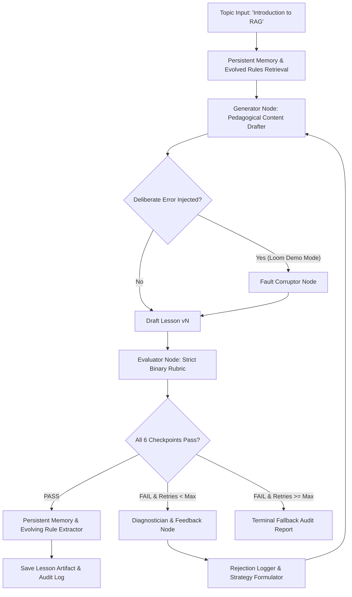

# 🎓 Content Systems: Autonomous Self-Evaluating Lesson Content Generator

[](https://python.org)
[](https://github.com/langchain-ai/langgraph)
[]()
[]()

A production-grade, autonomous **Self-Evaluating Lesson Content Generator** built for the **GenAI Engineer - Content Systems** assessment.

The system generates beginner AI lesson content tailored specifically for **12th-grade graduates from India with a non-English-medium background and limited English vocabulary**, audits its own quality against a strict zero-tolerance binary rubric, diagnoses rejections, surgically repairs flaws across iterations, persists cross-run failure memories, and dynamically evolves generation guidelines.

---

## 🎯 Target Persona Calibration

- **Learner Profile**: 12th-grade graduate from India.
- **Language Background**: Non-English-medium schooling, limited English vocabulary (A2–B1 CEFR level).
- **Pedagogical Strategy**:
  - Relatable Indian daily-life analogies (e.g. *Open-Book vs. Closed-Book Exam*, *Chef with Recipe Cards*).
  - Short sentences (<18 words), active voice, conversational tone.
  - Zero unexplained technical jargon (*LLM, Hallucination, Retrieval* unpacked immediately).
  - Explicit clarification that RAG does **never retrain or modify neural model weights**.
  - Interactive 3-question Multiple Choice Quiz with answers and explanations.

---

## 🏗️ System Architecture & Workflow



### Core Components

1. **LangGraph State Engine (`content_agent/graph.py`)**:
   - Manages cyclical agentic transitions (`generate` → `evaluate` → `diagnose` → `regenerate` → `memory_update`).
   - Guarantees termination with deterministic max-retry limits (1–2 retries).
2. **Pedagogical Generator (`content_agent/generator.py`)**:
   - Multi-provider support (**Google Gemini 2.5 Flash** & **Groq Qwen-2.5**).
   - Injects long-term evolved rules and differential revision feedback.
3. **Strict Binary Evaluator (`content_agent/evaluator.py`)**:
   - Zero Partial Credit: All 6 checkpoints must strictly PASS.
   - Dual-layer evaluation combining structured LLM evaluation with deterministic regex sanity guards.
4. **Diagnostician & Rejection Logger (`content_agent/diagnostician.py` & `logger.py`)**:
   - Extracts offending snippets and formulates surgical remediation instructions.
   - Exports structured JSON audit trails to `outputs/rejection_log.json`.
5. **Self-Evolving Long-Term Memory (`content_agent/memory.py`)**:
   - Persists run traces to SQLite (`storage/memory.db`).
   - Analyzes repeated failure patterns across runs and synthesizes new dynamic prompt guidelines exported to `outputs/evolved_rules.json`.
6. **Deliberate Error Injection Test Suite (`content_agent/error_injector.py`)**:
   - Injects targeted faults (`unexplained_jargon`, `missing_why`, `dense_vocabulary`, `factual_error`) to demonstrate on camera: **Inject Error → Evaluator Rejects (FAIL) → Diagnostic Log Generated → Generator Self-Corrects on Retry → Evaluator Approves (PASS)**.

---

## 📋 Strict Binary Evaluation Rubric

| Checkpoint | Pass Criteria | Fail Trigger |
| :--- | :--- | :--- |
| **`grounded_accuracy`** | Accurately describes RAG as fetching external reference notes for the LLM without retraining or fine-tuning model weights. | Falsely claims RAG retrains/updates model weights or provides false technical mechanics. |
| **`vocabulary_accessibility`** | Uses simple words and short sentences easily understood by a 12th-grade Indian non-English-medium student. | High-syllable academic words (e.g. *epistemological, paradigm, didactic exposition, stochastic variance*). |
| **`pedagogical_analogy`** | Incorporates an intuitive everyday analogy (e.g. Open-Book vs Closed-Book Exam) mapping directly to Retriever and Generator. | Lacks an everyday analogy or uses abstract/confusing computer science metaphors. |
| **`unexplained_jargon_guard`** | Every technical term used is immediately translated into friendly plain English upon first mention. | Drops terms like *Cosine Similarity, Latent Hilbert Space, Vectors, Tokens, HNSW* without explanation. |
| **`core_coverage`** | Clearly and distinctly covers: (1) What is RAG, (2) Why it is needed (knowledge cutoff & hallucination), and (3) How it works step-by-step. | Omits or glosses over any of the 3 fundamental pillars. |
| **`pedagogical_flow`** | Follows logical progression: Hook → Analogy → Problem → Solution → Step-by-Step Flow → Interactive Quiz. | Disorganized jumping between concepts, missing summary, or missing comprehension quiz. |

---

## 🚀 Quickstart & Setup Guide

### 1. Prerequisites & Installation

```bash
# Clone the repository
git clone https://github.com/sohail/content-systems.git
cd content_systems

# Create virtual environment and install dependencies using uv (or standard pip)
uv venv --python 3.12
source .venv/bin/activate
uv pip install -e ".[dev]"
```

### 2. Configure Environment Keys

Copy the template and add your API keys (Google Gemini or Groq):

```bash
cp .env.example .env
```

Edit `.env`:
```ini
GEMINI_API_KEY=your_gemini_api_key_here
GROQ_API_KEY=your_groq_api_key_here
PRIMARY_MODEL=gemini-2.5-flash
FALLBACK_MODEL=qwen/qwen3.6-27b
```

---

## 🖥️ Running the Agentic Pipeline

### Option A: Interactive Streamlit Web Studio (Recommended for Demo)

```bash
streamlit run ui/app.py
```
- **Features**: Live LangGraph execution, glowing pass/fail scorecard badges, deliberate error injection dropdown, side-by-side diff comparison between rejected Draft 1 and passed Draft 2, JSON rejection inspector, and Markdown export.

### Option B: Rich Terminal CLI

```bash
# 1. Standard run (Generates passed lesson)
python -m ui.cli --topic "Introduction to RAG"

# 2. Deliberate Error Demo (Injects jargon into Draft 1 -> Evaluator catches -> Generator self-corrects on Retry)
python -m ui.cli --topic "Introduction to RAG" --inject-error unexplained_jargon

# 3. View persistent evolved memory rules
python -m ui.cli --list-rules
```

---

## 🧪 Automated Testing Suite

Run the comprehensive Pytest suite:

```bash
pytest tests/ -v
```

Test coverage includes:
- `tests/test_evaluator.py`: Strict binary checkpoint verification on clean vs. flawed lessons.
- `tests/test_error_injection.py`: Verifying all 4 deliberate error corruption and detection hooks.
- `tests/test_memory.py`: SQLite persistence, rejection tracking, and rule extraction.
- `tests/test_generator.py`: Persona calibration and structural generation.
- `tests/test_full_pipeline.py`: End-to-end self-correction loops.

---

## 📂 Project Directory Structure

```
content_systems/
├── README.md                          # Production documentation & setup guide
├── pyproject.toml                     # Project packaging & dependencies
├── .env.example                       # API key templates
├── content_agent/
│   ├── __init__.py
│   ├── config.py                      # Models, rubric definitions, prompts
│   ├── state.py                       # Pydantic schemas & TypedDict graph state
│   ├── generator.py                   # Pedagogical generation & differential repair
│   ├── evaluator.py                   # Strict binary rubric evaluator + regex guards
│   ├── diagnostician.py               # Rejection diagnosis & surgical revision builder
│   ├── memory.py                      # SQLite/JSON memory & rule evolution engine
│   ├── error_injector.py              # Deliberate fault injection harness for Loom demo
│   ├── graph.py                       # LangGraph compilation & workflow execution
│   └── logger.py                      # Audit trail & structured rejection logging
├── ui/
│   ├── app.py                         # Streamlit interactive visual studio
│   └── cli.py                         # Rich terminal CLI
├── storage/                           # Persistent local DB
│   └── memory.db
├── outputs/
│   ├── LESSON_INTRODUCTION_TO_RAG.md  # Final passing lesson
│   ├── rejection_log.json             # Structured rejection log artifact
│   └── evolved_rules.json             # Evolved rule snapshot
├── tests/
│   ├── test_generator.py
│   ├── test_evaluator.py
│   ├── test_error_injection.py
│   ├── test_memory.py
│   └── test_full_pipeline.py
└── docs/
    ├── LOOM_VIDEO_SCRIPT.md           # 15-20 min video walkthrough script
    └── SUBMISSION_DOCUMENT.md         # Full technical write-up for Google Form
```

---

## 📹 Submission Deliverables

- **Submission Google Form**: [https://forms.gle/a7MJUNoTxvSdRB8R6](https://forms.gle/a7MJUNoTxvSdRB8R6)
- **15–20 Min Video Script**: Available in [`docs/LOOM_VIDEO_SCRIPT.md`](docs/LOOM_VIDEO_SCRIPT.md)
- **Final Submission Report**: Available in [`docs/SUBMISSION_DOCUMENT.md`](docs/SUBMISSION_DOCUMENT.md)
- **Passing Lesson Content**: Available in [`outputs/LESSON_INTRODUCTION_TO_RAG.md`](outputs/LESSON_INTRODUCTION_TO_RAG.md)
- **Sample Rejection Audit Log**: Available in [`outputs/rejection_log.json`](outputs/rejection_log.json)
