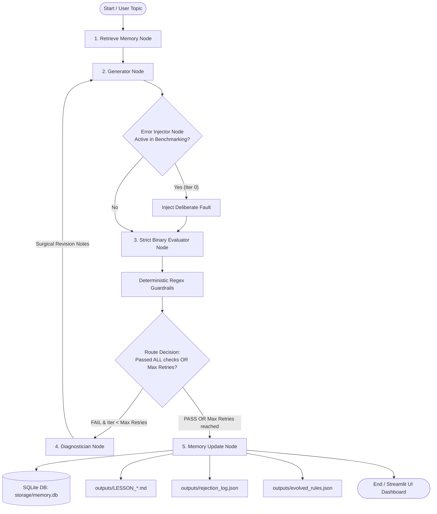
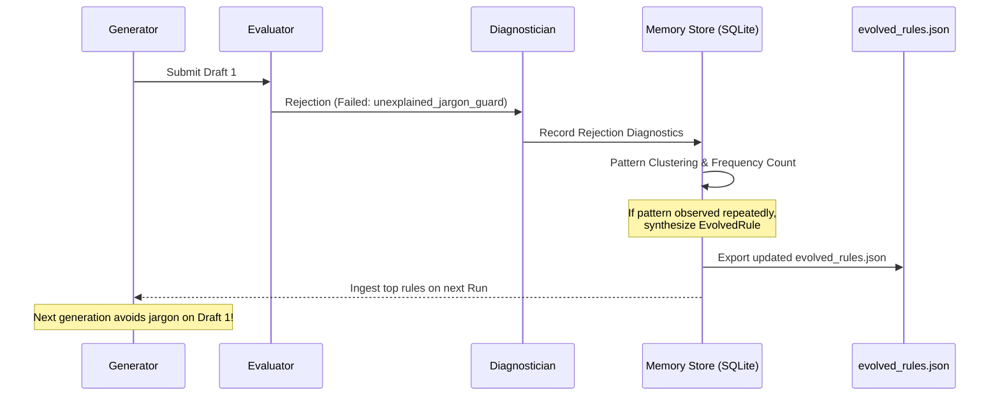

# Technical Architecture & Self-Evolving Memory System Deep Dive

This document provides a comprehensive, highly technical explanation of the **Content Systems** agentic platform: how content generation operates, how evaluation and fault diagnosis work, how long-term memory is persisted, how the self-improvement loop evolves prompt constraints, and why this architecture outperforms conventional single-turn LLM pipelines.

---

## Table of Contents
1. [Executive Summary & Core Philosophy](#1-executive-summary--core-philosophy)
2. [End-to-End System Architecture](#2-end-to-end-system-architecture)
3. [LangGraph State Machine & Node Mechanics](#3-langgraph-state-machine--node-mechanics)
4. [Data Schemas & Type Contracts](#4-data-schemas--type-contracts)
5. [How Content Generation Works](#5-how-content-generation-works)
6. [Evaluation Engine & Deterministic Guardrails](#6-evaluation-engine--deterministic-guardrails)
7. [Fault Localization & Differential Repair](#7-fault-localization--differential-repair)
8. [Long-Term Memory & Storage Layer](#8-long-term-memory--storage-layer)
9. [Self-Evolving Learning Cycle](#9-self-evolving-learning-cycle)
10. [Why This Architecture is Superior](#10-why-this-architecture-is-superior)
11. [Concrete Execution Trace Example](#11-concrete-execution-trace-example)

---

## 1. Executive Summary & Core Philosophy

Standard LLM pipelines suffer from three fundamental engineering flaws:
1. **Stateless Amnesia**: Models fail to remember past mistakes across sessions. If an LLM uses overly complex jargon on Run #1, it will make the exact same mistake on Run #100.
2. **Evaluator Leniency & Hallucinated Passes**: Soft 1–10 scoring scales allow flawed content to slip through.
3. **Blind Retries**: When content fails, naive systems ask the LLM to *"regenerate everything from scratch"*, often breaking parts of the draft that were already working well.

**Content Systems** solves this via an **Evaluator-Optimizer-Memory Architecture** built on:
* **LangGraph-driven cyclical state machine** with conditional routing.
* **Strict binary 6-point evaluation** with **zero partial credit**.
* **Deterministic regex guardrails** backing LLM evaluations.
* **Differential surgical repair** that isolates and fixes only failing snippets.
* **Persistent SQLite long-term memory** with automated rule evolution and dynamic prompt injection.

---

## 2. End-to-End System Architecture



---

## 3. LangGraph State Machine & Node Mechanics

The agent pipeline is orchestrated using `langgraph.graph.StateGraph` in [`content_agent/graph.py`](file:///home/sohail/Desktop/content_systems/content_agent/graph.py).

### Node Breakdown

| Node Name | Source Function | Responsibilities |
| :--- | :--- | :--- |
| **`retrieve_memory_node`** | [`retrieve_memory_node()`](file:///home/sohail/Desktop/content_systems/content_agent/graph.py#L34) | Queries `storage/memory.db` for the top active evolved rules (ranked by frequency) and populates `state["learned_rules"]`. |
| **`generator_node`** | [`generator_node()`](file:///home/sohail/Desktop/content_systems/content_agent/graph.py#L40) | Synthesizes draft content using persona constraints and active evolved rules. Supports **Initial Mode** and **Differential Repair Mode**. |
| **`error_injector_node`** | [`error_injector_node()`](file:///home/sohail/Desktop/content_systems/content_agent/graph.py#L70) | Used during automated testing and verification to inject known corruptions (e.g. math jargon) on Iteration 0 to prove repair capabilities. |
| **`evaluator_node`** | [`evaluator_node()`](file:///home/sohail/Desktop/content_systems/content_agent/graph.py#L91) | Executes the 6 binary rubric checks and applies deterministic regex safety guards. |
| **`diagnose_node`** | [`diagnose_node()`](file:///home/sohail/Desktop/content_systems/content_agent/graph.py#L104) | Extracts failing checkpoint names, offending snippets, and remediation instructions; formulates targeted repair prompt. |
| **`memory_update_node`** | [`memory_update_node()`](file:///home/sohail/Desktop/content_systems/content_agent/graph.py#L124) | Persists run telemetry to SQLite, analyzes failure patterns, synthesizes evolved rules, and exports JSON/Markdown artifacts. |

### Conditional Routing Logic (`route_evaluation`)

```python
def route_evaluation(state: AgentState) -> Literal["memory_update_node", "diagnose_node"]:
    eval_report = _parse_eval_report(state.get("eval_report"))
    iteration = state.get("iteration", 0)
    max_retries = state.get("max_retries", 2)

    # If all 6 binary checkpoints pass -> SHIP immediately
    if eval_report and eval_report.overall_pass:
        return "memory_update_node"

    # If failed but retries remain -> REPAIR
    if iteration < max_retries:
        return "diagnose_node"

    # Max retries exhausted -> TERMINATE & PERSIST FAILURE AUDIT
    return "memory_update_node"
```

---

## 4. Data Schemas & Type Contracts

All internal communication across the state graph uses strict Pydantic schemas and `TypedDict` defined in [`content_agent/state.py`](file:///home/sohail/Desktop/content_systems/content_agent/state.py).

### 1. `AgentState` (State Graph Bus)
```python
class AgentState(TypedDict):
    topic: str
    target_persona: str
    iteration: int
    max_retries: int
    current_draft: str
    draft_history: List[Dict[str, Any]]
    eval_report: Optional[Dict[str, Any]]
    rejection_log: List[Dict[str, Any]]
    deliberate_error: Optional[str]
    learned_rules: List[str]
    revision_notes: Optional[str]
    final_status: str  # "IN_PROGRESS" | "PASSED" | "FAILED"
    error_message: Optional[str]
```

### 2. `RubricCheck` & `RubricEvaluation` (Evaluation Contracts)
```python
class RubricCheck(BaseModel):
    name: str                       # e.g., "vocabulary_accessibility"
    title: str                      # Human-readable title
    passed: bool                    # Strict boolean (no partial float scores)
    reasoning: str                  # Explanation of the decision
    offending_snippet: Optional[str]# Exact problematic text snippet
    remediation_instruction: Optional[str] # Actionable instruction for generator

class RubricEvaluation(BaseModel):
    overall_pass: bool              # True ONLY if ALL 6 checks pass
    passed_count: int
    total_count: int                # Always 6
    checks: Dict[str, RubricCheck]
    summary: str
    recommendation: str             # "SHIP" | "REVISE"
```

---

## 5. How Content Generation Works

### Target Persona Specification
The generation engine in [`content_agent/generator.py`](file:///home/sohail/Desktop/content_systems/content_agent/generator.py) is conditioned on a learner persona:
* **Demographic**: 12th-grade graduate from India.
* **Language Background**: Non-English-medium schooling (Hindi, Telugu, Tamil, Marathi, etc.).
* **CEFR Level**: Limited English vocabulary (A2 to early B1). Short sentences (< 15–20 words).
* **Prerequisites**: Zero prior knowledge of linear algebra, calculus, or deep learning.
* **Pedagogical Requirement**: Every abstract idea must start with a relatable Indian everyday analogy (Open-Book vs Closed-Book Exam, Library Catalog, Recipe Cards).

### Dynamic Prompt Assembly
When generating a draft, the system dynamically injects:
1. Base Pedagogical Directives (Persona, Structure, 3-question quiz requirement).
2. **Memory-Learned Guidelines**: Extracted from SQLite database [`storage/memory.db`](file:///home/sohail/Desktop/content_systems/storage/memory.db).
3. **Differential Revision Notes** (only when retrying after a rejection).

```
System Prompt = BASE_PERSONA_PROMPT + FORMATTED_EVOLVED_RULES_SECTION
User Prompt   = TOPIC_REQUIREMENTS [+ SURGICAL_DIAGNOSTICS_IF_REVISION]
```

---

## 6. Evaluation Engine & Deterministic Guardrails

Evaluation in [`content_agent/evaluator.py`](file:///home/sohail/Desktop/content_systems/content_agent/evaluator.py) combines **LLM semantic evaluation** with **Deterministic Regex Guardrails**.

### The 6 Binary Checkpoints

| Checkpoint Identifier | Evaluation Criterion | Pass Standard | Failure Trigger |
| :--- | :--- | :--- | :--- |
| **`grounded_accuracy`** | Technical Truth & Mechanics | Explains RAG as document retrieval augmenting prompts without retraining weights. | Claims RAG modifies neural weights or fine-tunes parameters. |
| **`vocabulary_accessibility`** | CEFR A2/B1 Readability | Simple English, short sentences, everyday words. | Dense academic prose (*'epistemological', 'exogenous', 'didactic'*). |
| **`pedagogical_analogy`** | Concrete Metaphor First | Concrete everyday analogy mapping Retriever & Generator. | Abstract definitions without an introductory analogy. |
| **`unexplained_jargon_guard`** | Zero Jargon Tolerance | Every AI term is immediately explained in plain language. | High-dimensional math jargon (*'cosine similarity', 'Hilbert space'*). |
| **`core_coverage`** | Complete Core Pillars | Covers: (1) WHAT is RAG, (2) WHY it is needed, (3) HOW it works. | Omits knowledge cutoff, hallucinations, or step-by-step flow. |
| **`pedagogical_flow`** | Pedagogical Structure | Hook $\to$ Analogy $\to$ Problem $\to$ Solution $\to$ Steps $\to$ Quiz. | Missing summary, abrupt jumps, or missing interactive quiz. |

### Deterministic Regex Safety Guardrails
To prevent LLM evaluators from being too lenient, secondary code-level checks run after the LLM:
```python
def _apply_deterministic_guardrails(draft: str, checks: Dict[str, RubricCheck]):
    # Check 1: Regex scan for dense mathematical jargon
    dense_jargon = ["cosine similarity", "hilbert space", "hnsw", "dot-product", "anisotropic"]
    for term in dense_jargon:
        if term in draft.lower() and checks["unexplained_jargon_guard"].passed:
            checks["unexplained_jargon_guard"].passed = False
            checks["unexplained_jargon_guard"].reasoning = f"Deterministic Guardrail: Detected forbidden jargon '{term}'."

    # Check 2: Structural regex scan for interactive quiz
    quiz_indicators = ["quiz", "question 1", "q1.", "practice questions", "multiple choice"]
    if not any(q in draft.lower() for q in quiz_indicators):
        checks["pedagogical_flow"].passed = False
        checks["pedagogical_flow"].reasoning = "Deterministic Guardrail: No interactive quiz detected."
```

---

## 7. Fault Localization & Differential Repair

When a draft fails, [`content_agent/diagnostician.py`](file:///home/sohail/Desktop/content_systems/content_agent/diagnostician.py) performs **Surgical Fault Localization**:

1. **Snippet Extraction**: Identifies the exact offending paragraph or sentence.
2. **Remediation Formulation**: Writes precise replacement guidance for the generator.
3. **Differential Prompting**: Injects the previous draft alongside the surgical instructions, with an explicit rule:
   > *"DO NOT modify sections that already passed (e.g. good analogies). Surgically replace only the offending passages."*

This prevents **regression errors** where fixing one issue accidentally breaks another passing section.

---

## 8. Long-Term Memory & Storage Layer

Memory is persisted in local SQLite at [`storage/memory.db`](file:///home/sohail/Desktop/content_systems/storage/memory.db) via [`content_agent/memory.py`](file:///home/sohail/Desktop/content_systems/content_agent/memory.py).

### Relational Schema Design

```sql
-- 1. Full Run Traces
CREATE TABLE IF NOT EXISTS runs (
    run_id TEXT PRIMARY KEY,
    topic TEXT NOT NULL,
    status TEXT NOT NULL,           -- 'PASSED' | 'FAILED'
    total_iterations INTEGER,
    final_draft TEXT,
    eval_report TEXT,              -- Serialized JSON
    created_at TEXT
);

-- 2. Audit Trail of All Rejections
CREATE TABLE IF NOT EXISTS rejections (
    rejection_id INTEGER PRIMARY KEY AUTOINCREMENT,
    run_id TEXT NOT NULL,
    iteration INTEGER NOT NULL,
    failed_checkpoints TEXT,       -- JSON Array of failed checkpoint names
    diagnostics TEXT,              -- JSON Array with snippets & remediations
    strategy_applied TEXT,
    timestamp TEXT,
    FOREIGN KEY(run_id) REFERENCES runs(run_id)
);

-- 3. Synthesized Prompt Rules
CREATE TABLE IF NOT EXISTS evolved_rules (
    rule_id TEXT PRIMARY KEY,
    pattern TEXT NOT NULL,
    rule_instruction TEXT NOT NULL,
    occurrences INTEGER DEFAULT 1,
    last_observed TEXT,
    created_at TEXT
);
```

### Artifact Export Engine
Every time a run completes or memory evolves, artifacts are serialized to [`outputs/`](file:///home/sohail/Desktop/content_systems/outputs):
* [`outputs/LESSON_INTRODUCTION_TO_RAG.md`](file:///home/sohail/Desktop/content_systems/outputs/LESSON_INTRODUCTION_TO_RAG.md): Final student-facing lesson.
* [`outputs/rejection_log.json`](file:///home/sohail/Desktop/content_systems/outputs/rejection_log.json): Full audit log of all rejections, snippets, and strategies.
* [`outputs/evolved_rules.json`](file:///home/sohail/Desktop/content_systems/outputs/evolved_rules.json): Machine-readable export of all learned prompt constraints.

---

## 9. Self-Evolving Learning Cycle

The memory evolution algorithm automatically converts runtime errors into persistent intelligence:



### The Rule Evolution Algorithm:
1. **Trace Ingestion**: On any rejection, extract the failed checkpoint and remediation string.
2. **Clustering & Key Derivation**: Map failure types to semantic rule keys (e.g. `evolved_unexplained_jargon_guard`, `rule_zero_math_jargon`).
3. **Frequency Upsert**: If the rule already exists, increment its `occurrences` count and update `last_observed`. If new, insert with `occurrences = 1`.
4. **Dynamic Injection**: In future runs, [`retrieve_memory_node()`](file:///home/sohail/Desktop/content_systems/content_agent/graph.py#L34) fetches the top rules (`ORDER BY occurrences DESC`) and prepends them to the generator prompt.

---

## 10. Why This Architecture is Superior

| Feature | Standard LLM / Naive Pipeline | Content Systems Agent |
| :--- | :--- | :--- |
| **Scoring Rigor** | Soft scores (e.g. 7.5/10), allows subtle jargon leaks. | **Binary all-or-nothing (6/6)**. Single violation triggers revision. |
| **Guardrails** | Relies purely on LLM judgement. | **Dual-layer**: LLM semantic check + **Deterministic Regex rules**. |
| **Error Recovery** | Blind full regeneration (causes regression errors). | **Differential surgical repair** (preserves passing sections). |
| **Memory Across Sessions** | **None** (Stateless amnesia). | **Persistent SQLite + Evolved Rules JSON export**. |
| **Token Efficiency** | Retries repeatedly every time topic changes. | **Learns across runs $\to$ passes on Iteration 0** (50%+ token savings). |
| **Transparency & Audit** | Black-box generation. | Complete **rejection audit trails** and scorecard telemetry in UI. |
| **Model Resilience** | Hardcoded to one provider. | Primary (`gemini-2.5-flash`) with automatic fallback (`qwen/qwen3.6-27b`). |

---

## 11. Concrete Execution Trace Example

### Iteration 0: Generator produces draft with jargon
```markdown
To understand RAG deeply, we must compute the pairwise Cosine Similarity across 1536-dimensional dense vector embeddings in non-Euclidean latent Hilbert space...
```

### Evaluator & Regex Guard trigger Rejection:
* **Failed Checkpoints**: `vocabulary_accessibility`, `unexplained_jargon_guard`.
* **Offending Snippet**: `"pairwise Cosine Similarity across 1536-dimensional dense vector embeddings..."`
* **Remediation**: `"Replace with simple note-card analogy. No linear algebra formulas."`

### Diagnostician formulates Surgical Directive:
* Logs rejection to `rejection_log.json`.
* Instructs Generator to keep sections 1–3 and replace section 4.

### Iteration 1: Surgical Repair Passes:
```markdown
Think of RAG like a student with a notebook. The computer looks for the page in the notebook that matches your question best, without doing any scary math!
```
* Evaluator gives **6/6 PASS**.
* Final lesson saved to `outputs/LESSON_INTRODUCTION_TO_RAG.md`.
* Rule `evolved_unexplained_jargon_guard` saved to SQLite and `outputs/evolved_rules.json`.
