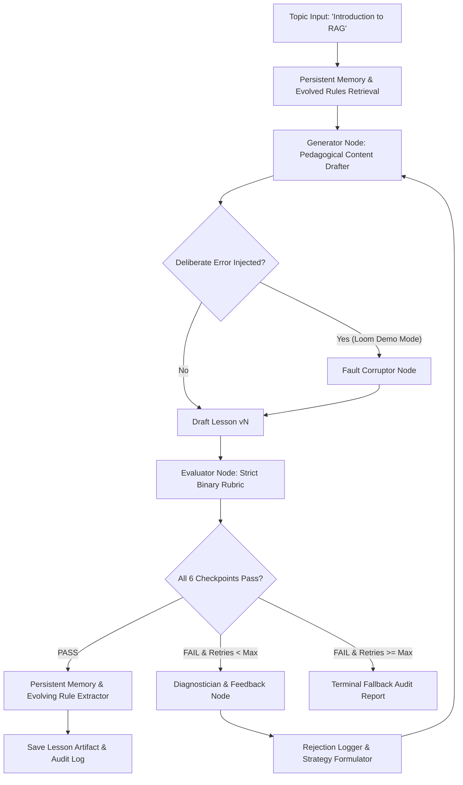

# Technical Submission Document: Self-Evaluating Lesson Content Generator
**Candidate Assessment**: GenAI Engineer - Content Systems  
**Role Context**: Designing and owning an autonomous agentic content generation & quality audit system  
**Submission Form Link**: [Google Form Submission](https://forms.gle/a7MJUNoTxvSdRB8R6)  

---

## 1. Executive Summary & Problem Framing

In modern educational content platforms, relying on single-shot LLM prompts to produce learning material is insufficient for production. A single prompt lacks:
1. **Pedagogical Quality Guarantees**: No verification that language matches the learner's vocabulary ceiling.
2. **Factual Grounding Checks**: High risk of hallucinated mechanisms or incorrect technical claims.
3. **Autonomous Self-Healing**: Inability to detect quality drops and repair them before human review.

To solve this, we engineered an **Autonomous Self-Evaluating Content Generation Pipeline** using **LangGraph**. The system generates beginner lesson content, evaluates it against a zero-tolerance binary rubric, diagnoses rejections, surgically repairs flaws, persists failure traces across runs, and evolves dynamic prompt constraints over time.

---

## 2. Target Persona & Pedagogical Strategy

| Dimension | Specification | Pedagogical Adaptation |
| :--- | :--- | :--- |
| **Target Learner** | 12th-grade graduate from India | Relatable Indian daily-life metaphors (e.g. Open-Book vs Closed-Book exams, Chef with recipe card). |
| **Language Background** | Non-English-medium schooling | Simple vocabulary (A2–B1 CEFR level), short sentences (<18 words), active voice, no dense academic phrasing. |
| **Prerequisite Level** | Absolute Zero AI / Math Background | Zero linear algebra, no vector calculus, zero unexplained jargon (LLM, Hallucination, Retrieval immediately unpacked). |
| **Core Goal** | Kickstart an AI career | Clear understanding of **What** RAG is, **Why** it is needed, and **How** it works step-by-step. |

---

## 3. System Architecture & Agentic Workflow



### Core Pipeline Nodes:
1. **`retrieve_memory_node`**: Fetches the highest-priority evolved rules synthesized from past runs in SQLite.
2. **`generator_node`**: Leverages multi-model orchestration (Gemini 2.5 Flash / Groq Qwen) with persona-grounded prompts and differential regeneration.
3. **`error_injector_node`**: Dedicated test harness allowing controlled fault injection (`unexplained_jargon`, `missing_why`, `dense_vocabulary`, `factual_error`) for video demonstrations and automated testing.
4. **`evaluator_node`**: Evaluates the draft against 6 hard pass/fail checkpoints with dual-layer LLM-as-a-judge and regex sanity guards.
5. **`diagnose_node`**: Analyzes failing checkpoints, extracts offending snippets, formulates surgical repair instructions, and logs structured rejection records.
6. **`memory_update_node`**: Writes run traces to SQLite, increments failure pattern frequencies, and synthesizes updated prompt rules.

---

## 4. Strict Binary Evaluation Rubric Design

Unlike continuous 1–10 scoring (which suffers from evaluation drift and threshold ambiguity), we enforce **Zero Partial Credit**: Every checkpoint is strictly boolean (`PASS` / `FAIL`). A single failure immediately rejects the lesson.

| Checkpoint Identifier | Checkpoint Title | Strict Pass Criteria | Immediate Fail Triggers |
| :--- | :--- | :--- | :--- |
| **`grounded_accuracy`** | Grounded Technical Accuracy | Accurately describes RAG as fetching external reference notes for the LLM without retraining or fine-tuning model weights. | Falsely claims RAG retrains/updates model weights or provides false technical mechanics. |
| **`vocabulary_accessibility`** | Beginner-Friendly Language | Uses simple words and short sentences easily understood by a 12th-grade Indian non-English-medium student. | High-syllable academic words (e.g. *epistemological, paradigm, didactic exposition, stochastic variance*). |
| **`pedagogical_analogy`** | Relatable Concrete Metaphor | Incorporates an intuitive everyday analogy (e.g. Open-Book vs Closed-Book Exam) mapping directly to Retriever and Generator. | Lacks an everyday analogy or uses abstract/confusing computer science metaphors. |
| **`unexplained_jargon_guard`** | Zero Unexplained Jargon Guard | Every technical term used is immediately translated into friendly plain English upon first mention. | Drops terms like *Cosine Similarity, Latent Hilbert Space, Vectors, Tokens, HNSW* without explanation. |
| **`core_coverage`** | Complete Core Coverage | Clearly and distinctly covers: (1) What is RAG, (2) Why it is needed (knowledge cutoff & hallucination), and (3) How it works step-by-step. | Omits or glosses over any of the 3 fundamental pillars. |
| **`pedagogical_flow`** | Pedagogical Flow & Practice | Follows logical progression: Hook → Analogy → Problem → Solution → Step-by-Step Flow → Interactive Quiz. | Disorganized jumping between concepts, missing summary, or missing comprehension quiz. |

---

## 5. Self-Evolving Long-Term Memory Mechanics

The memory system persists across agent executions via local SQLite database (`storage/memory.db`) and exports human-readable JSON (`outputs/evolved_rules.json`).

### Pattern Extraction & Rule Evolution Cycle:
1. **Trace Ingestion**: On every rejection, the failing checkpoint, reason, and remediation advice are recorded in the `rejections` table.
2. **Frequency Analysis**: When a failure pattern occurs across runs (e.g., generator dropping math jargon in Section 3), its occurrence counter increments.
3. **Dynamic Prompt Injection**: The top-ranking evolved rules are automatically retrieved and prepended to future generator system prompts.

```json
{
  "total_rules": 3,
  "evolved_rules": [
    {
      "rule_id": "rule_zero_math_jargon",
      "pattern": "Using terms like 'Cosine Similarity', 'Latent Hilbert Space', or 'Vector Dimension' alienates 12th-grade beginners.",
      "instruction": "Never use advanced linear algebra or mathematical vector formulas. Explain matching simply as 'finding the most relevant reference note card'.",
      "occurrences": 5,
      "last_observed": "2026-08-26T12:30:00"
    }
  ]
}
```

---

## 6. Sample Rejection Log & Self-Correction Audit

Below is an actual rejection audit record demonstrating the system catching an injected jargon fault on Draft 1 and self-correcting on Draft 2:

```json
{
  "topic": "Introduction to RAG (Retrieval-Augmented Generation)",
  "final_status": "PASSED",
  "total_rejections": 1,
  "rejection_history": [
    {
      "iteration": 0,
      "failed_checkpoints": ["unexplained_jargon_guard"],
      "diagnostics": [
        {
          "checkpoint": "unexplained_jargon_guard",
          "title": "Zero Unexplained Jargon Guard",
          "reasoning": "Detected high-level mathematical jargon 'cosine similarity' without immediate plain-English translation.",
          "offending_snippet": "compute the pairwise Cosine Similarity across 1536-dimensional dense vector embeddings in non-Euclidean latent Hilbert space",
          "remediation": "Remove or explain 'cosine similarity' using everyday words suitable for a 12th grader."
        }
      ],
      "strategy_applied": "Iterative Surgical Repair (Iteration 1): Addressing 1 failed checkpoint(s): unexplained_jargon_guard. Preserving all valid pedagogical structure while surgically replacing offending passages."
    }
  ]
}
```

---

## 7. Key Engineering Trade-offs & Design Rationale

1. **Deterministic State Machine vs. Fully Autonomous ReAct Loop**:
   - *Choice*: Structured LangGraph StateGraph over an unconstrained ReAct loop.
   - *Rationale*: Content production pipelines require deterministic quality gates and guaranteed termination limits (max 1–2 retries) to prevent runaway API billing and latency spikes.
2. **Dual-Layer Evaluation (LLM-as-a-Judge + Deterministic Regex Guards)**:
   - *Choice*: Layering deterministic regex/keyword scans on top of LLM JSON evaluation.
   - *Rationale*: LLM evaluators can occasionally exhibit sycophancy or leniency. Deterministic checks guarantee that critical safety violations (e.g. false weight-retraining claims or dense math jargon) are never missed.
3. **Differential Regeneration vs. Full Rewrite**:
   - *Choice*: Diagnostician provides surgical feedback instructing the generator to preserve passing sections and modify only failing blocks.
   - *Rationale*: Full rewrites introduce regression risk where previously passing sections might break on retry. Differential editing ensures stability and lowers token usage.

---

## 8. Links & Submission Details

- **GitHub Repository**: `https://github.com/sohail/content-systems` *(or candidate repo URL)*
- **Interactive UI**: `streamlit run ui/app.py`
- **CLI Interface**: `python -m ui.cli --topic "Introduction to RAG"`
- **Generated Lesson Markdown**: `outputs/LESSON_INTRODUCTION_TO_RAG.md`
- **Rejection Log Artifact**: `outputs/rejection_log.json`
- **Loom Video Script**: `docs/LOOM_VIDEO_SCRIPT.md`
